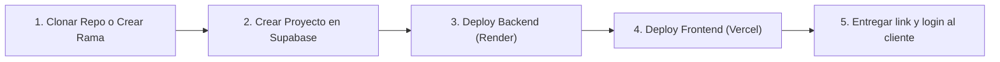

# 🚀 Guía de Producción y Replicación para Nuevos Clientes

Esta guía detalla cómo poner este proyecto en producción y la **"receta de 5 minutos"** para clonarlo y venderlo a cualquier nuevo negocio o complejo deportivo.

---

## 🏗️ Arquitectura de Producción (Recomendada y Gratuita / Low-Cost)

- **Frontend:** [Vercel](https://vercel.com/) (Deploy gratuito, rápido con CDN global y SSL automático).
- **Backend:** [Render](https://render.com/) o [Railway](https://railway.app/) (Web Service Node.js).
- **Base de Datos:** [Supabase](https://supabase.com/) (PostgreSQL administrado con 500 MB gratis por proyecto).
- **Pasarela de Cobros:** [Mercado Pago](https://www.mercadopago.com.ar/developers/) (Cobro de señas con acreditación directa a la cuenta del cliente).

---

## ⚡ Paso a Paso: Desplegar el Proyecto Actual en Producción

### 1. Base de Datos en Supabase
1. Ingresá a [Supabase](https://supabase.com/) y creá un proyecto para el negocio (o usá el actual).
2. Andá a **SQL Editor** y pegá el contenido de:
   `supabase/setup_cliente_produccion.sql`
3. Hacé clic en **Run**. Listo: tablas, índices, permisos y usuario inicial configurados.
4. En **Project Settings > API**, copiá:
   - `Project URL`
   - `service_role secret` (clave secreta del backend)
   - `anon public` (clave pública del frontend)

---

### 2. Backend en Render (o Railway)
1. Subí el repositorio a GitHub.
2. En [Render](https://render.com/), creá un **New Web Service** conectado a tu repositorio.
3. Configurá:
   - **Root Directory:** `backend`
   - **Build Command:** `npm install`
   - **Start Command:** `npm start`
4. En la pestaña **Environment**, agregá las variables:
   ```env
   PORT=3000
   ADMIN_PASSWORD=la_contraseña_maestra_que_quieras
   JWT_SECRET=un_secreto_largo_y_seguro
   SUPABASE_URL=https://tu-proyecto.supabase.co
   SUPABASE_SERVICE_ROLE=tu_service_role_secret
   MP_ACCESS_TOKEN=APP_USR-tu-access-token-de-mercadopago
   FRONTEND_URL=https://nombre-del-cliente.vercel.app
   WEBHOOK_URL=https://tu-backend.onrender.com/webhook
   ```
5. Hacé clic en **Deploy**. Copiá la URL de tu backend (ej. `https://tu-backend.onrender.com`).

---

### 3. Frontend en Vercel
1. En [Vercel](https://vercel.com/), hacé clic en **Add New > Project** e importá el repositorio de GitHub.
2. Configurá:
   - **Root Directory:** `frontend`
   - **Framework Preset:** Vite
3. En **Environment Variables**, agregá:
   ```env
   VITE_API_URL=https://tu-backend.onrender.com
   VITE_SUPABASE_URL=https://tu-proyecto.supabase.co
   VITE_SUPABASE_ANON_KEY=tu_anon_public_key
   ```
4. Hacé clic en **Deploy**. ¡Listo! El sitio del cliente ya está online.

---

### 4. Mercado Pago del Cliente (Para recibir su dinero)
Para que el dinero vaya directamente a la cuenta del dueño del complejo:
1. Pedile al dueño que ingrese a [Mercado Pago Developers](https://www.mercadopago.com.ar/developers/panel/app).
2. Debe crear una aplicación (ej. *"Reservas Canchas"*) y copiar su **Access Token de Producción**.
3. Pegá ese Access Token en:
   - La variable `MP_ACCESS_TOKEN` del backend en Render, **O**
   - El dueño puede pegarlo directamente en el panel de administración (`/admin` > Pestaña Configuración).

---

## 💼 Cómo Replicar y Vender el Sistema a un Nuevo Cliente (5 Minutos)

Cuando cierres una venta con un nuevo complejo o cancha:



1. **Nuevo Proyecto en Supabase:**
   - Creás un proyecto nuevo en Supabase (plan gratuito).
   - Ejecutás `supabase/setup_cliente_produccion.sql`.
2. **Deploy Backend:**
   - En Render o Railway creás un nuevo servicio con el código del backend apuntando al nuevo Supabase y el token de Mercado Pago del nuevo cliente.
3. **Deploy Frontend:**
   - En Vercel creás un nuevo proyecto apuntando a la URL del nuevo backend.
   - Podés vincular el dominio personalizado del cliente (ej. `reservas.canchitaslapampa.com`).
4. **Entrega:**
   - Le das el link al dueño (`https://tunegocio.vercel.app/admin`).
   - El dueño ingresa con `admin@reservas.com` (o la contraseña maestra), cambia su nombre, teléfono, precios de seña, canchas y horarios directamente desde la pantalla.

