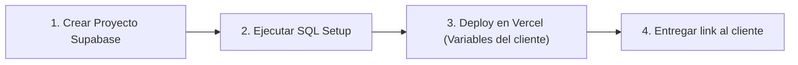

# 🚀 Guía de Producción y Replicación (100% Vercel + Supabase)

Esta guía detalla cómo poner este proyecto en producción y la **receta rápida de 3 minutos** para clonarlo y venderlo a cualquier negocio o complejo deportivo, **sin depender de Render ni de servidores que se duermen**.

---

## 🏗️ Arquitectura de Producción (Todo en Vercel + Supabase)

- **Todo el Sistema en [Vercel](https://vercel.com/):**
  - **Frontend:** React + Vite servido a través del CDN global de Vercel con SSL automático.
  - **Backend Serverless:** Express montado como función Serverless en `/api/*` (sin necesidad de Render, sin costos fijos, sin cold-starts prolongados, y con recepción inmediata de Webhooks de Mercado Pago).
  - **Sin problemas de CORS:** Tanto el frontend como las APIs se ejecutan en el mismo dominio (mismo origen).
- **Base de Datos:** [Supabase](https://supabase.com/) (PostgreSQL administrado gratuito).
- **Pasarela de Cobros:** [Mercado Pago](https://www.mercadopago.com.ar/developers/) (Cobro de señas con acreditación directa e instantánea a la cuenta del dueño del negocio).

---

## ⚡ Paso a Paso: Desplegar el Proyecto en Producción

### 1. Base de Datos en Supabase
1. Ingresá a [Supabase](https://supabase.com/) y creá un nuevo proyecto.
2. Andá a la sección **SQL Editor** y pegá el contenido completo del archivo:
   `supabase/setup_cliente_produccion.sql`
3. Hacé clic en **Run**. En menos de 5 segundos tendrás creadas las tablas (`negocios`, `reservas`, `usuarios`), índices de alta velocidad, usuario admin inicial y configuración base.
4. En **Project Settings > API**, copiá:
   - `Project URL`
   - `service_role secret` (clave privada para el backend)
   - `anon public` (clave pública)

---

### 2. Despliegue en Vercel (Frontend + Backend juntos)
1. Subí tu repositorio a GitHub.
2. Ingresá a tu cuenta de [Vercel](https://vercel.com/) y hacé clic en **Add New > Project**.
3. Importá el repositorio de GitHub.
4. **Configuración del proyecto en Vercel:**
   - **Root Directory:** `./` (dejar la raíz del proyecto, NO cambiar a frontend).
   - Vercel detectará automáticamente la configuración definida en `vercel.json`.
5. En la sección **Environment Variables**, agregá las siguientes variables:
   ```env
   SUPABASE_URL=https://tu-proyecto.supabase.co
   SUPABASE_SERVICE_ROLE=tu_service_role_secret_copiado_de_supabase
   ADMIN_PASSWORD=contraseña_maestra_que_elijas (ej. MiCancha2026!)
   JWT_SECRET=un_secreto_largo_y_aleatorio_para_los_tokens
   MP_ACCESS_TOKEN=APP_USR-tu-access-token-de-mercadopago
   ```
6. Hacé clic en **Deploy**.
   ¡Listo! En aproximadamente 1 minuto tendrás la aplicación funcionando en su URL de Vercel (ej: `https://mi-complejo.vercel.app`).

---

### 3. Configuración de Mercado Pago del Cliente
Para que los pagos de las señas vayan a la cuenta de Mercado Pago del cliente:
1. Pedile al dueño que ingrese a [Mercado Pago Developers](https://www.mercadopago.com.ar/developers/panel/app).
2. Debe crear una aplicación (ej. *"Reservas Canchas"*) y copiar su **Access Token de Producción**.
3. Podés colocarlo en la variable `MP_ACCESS_TOKEN` en Vercel, **O** el dueño puede ingresarlo directamente desde el panel de control:
   - Ingresa a `https://mi-complejo.vercel.app/admin`
   - Va a la pestaña **Configuración**
   - Pega el Access Token y guarda los cambios.
4. **Webhook de Mercado Pago:**
   En el panel de Mercado Pago Developers, en la sección de Notificaciones Webhooks, configurar la URL:
   `https://mi-complejo.vercel.app/api/webhook` con eventos de tipo `payment`.

---

## 💼 Receta para Clonar y Vender a un Nuevo Cliente en 3 Minutos

Cuando consigas un nuevo cliente:



1. **Supabase:** Creás un nuevo proyecto gratuito y corrés `supabase/setup_cliente_produccion.sql`.
2. **Vercel:** Hacés clic en **Add New Project**, elegís el repo (o un fork/rama del nuevo cliente) y cargás las variables de entorno de su proyecto Supabase y su clave maestra.
3. **Personalización del Negocio:**
   - Entrás al panel `/admin` con el login de administrador.
   - En **Configuración**, cambiás el nombre del complejo, teléfono de WhatsApp para reservas, dirección, valor de la seña, canchas y horarios disponibles.
4. **Dominio Propio (Opcional):**
   - Si el cliente tiene dominio (ej. `reservas.lacancha.com`), lo agregás en **Settings > Domains** en Vercel con un CNAME en minutos.
5. **¡Cobrás tu servicio y el cliente ya empieza a recibir reservas reales!**
